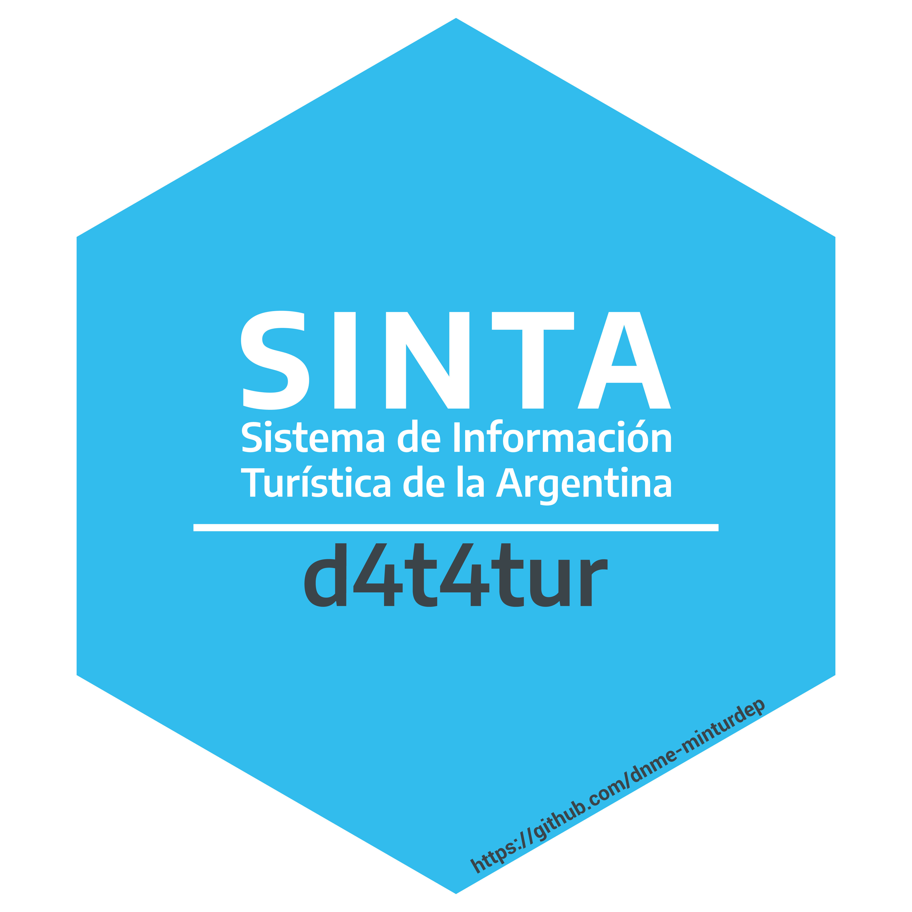

<!-- README.md is generated from README.Rmd. Please edit that file -->

```{r, include = FALSE}
knitr::opts_chunk$set(
  collapse = TRUE,
  comment = "#>",
  fig.path = "man/figures/README-",
  out.width = "100%"
)
```

# {d4t4tur} <a href="https://dnme-minturdep.github.io/d4t4tur/"></a>

<!-- badges: start -->
<!-- badges: end -->

El objetivo de d4t4tur es proveer a la [**Dirección Nacional de
Mercados y Estadísticas**](https://www.yvera.tur.ar/sinta/) una manera sencilla de instalar y cargar el conjunto de paquetes de trabajo de la Dirección Nacional de Mercados y Estadística del Minsiterio de Turismo y Deportes de Argentina. 

## Instalación

<!-- README.md is generated from README.Rmd. Please edit that file -->


## Instrucciones de instalación

Se puede instalar la versión en desarrollo de `{d4t4tur}` desde
[GitHub](https://github.com/) con la siguiente sentencia:

``` r
# install.packages("devtools")
devtools::install_github("dnme-minturdep/d4t4tur")
```

## Ejemplo de uso


```{r example}
library(d4t4tur)

```
